# RiskTrace Backend — Microservices Business Logic Suite

> *The business and data processing layer of the RiskTrace ecosystem. A secure, highly modular backend suite of 6 Spring Boot 3.2.4 microservices orchestrating service discovery, centralized JWT authentication gateway, log ingestion pipelines, and automated incident management.*

---

## Tech Stack & Core Libraries

- **Language & Runtime:** Java 21 (JDK 21)
- **Framework:** Spring Boot 3.2.4 & Spring Cloud (Eureka, Gateway)
- **Database:** MongoDB (isolated databases per microservice domain)
- **Security:** Spring Security (BCrypt password hashing), JWT Claims Validation
- **MFA:** `dev.samstevens.totp` (Two-Factor Authenticator logic)
- **Mail & Templates:** Spring Mail & Thymeleaf (HTML formatted alerts)
- **Reactive Streaming:** Spring Boot WebFlux (Server-Sent Events)

---

## Architecture Design

The backend enforces a strict **Database-per-Service Microservices Architecture**. This architecture eliminates direct database queries between services, ensures strict domain boundaries, and enables independent service scaling.

### Microservices System Architecture
This diagram outlines the communication paths between the Angular Frontend, Spring Cloud Gateway, the discovery service (Eureka), and the isolated downstream microservices with their dedicated database instances.

  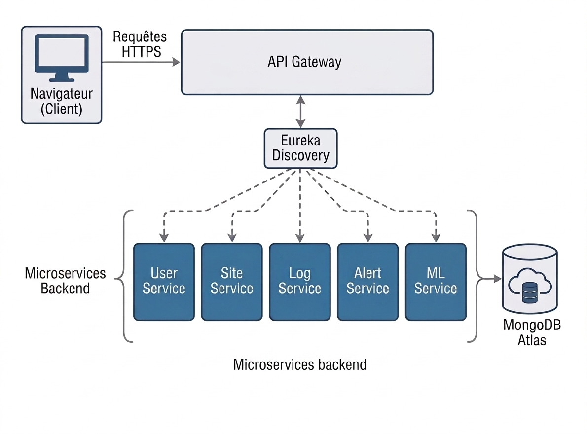

### Logical Layered Architecture
This diagram shows the logical stratification of the system from the presentation layer (Angular SPA), security and routing layer (Gateway), core business log processing services (Spring Boot), down to the persistent database boundaries.

  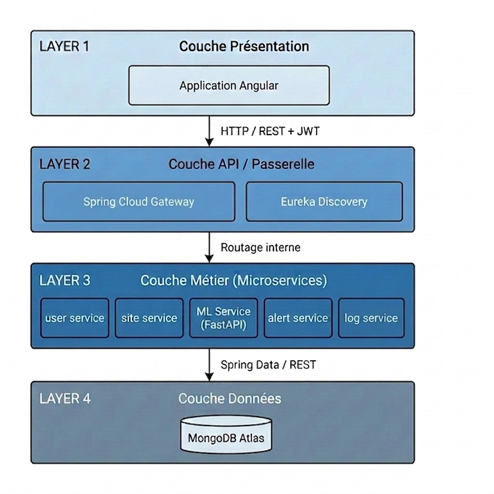

### UML Deployment Diagram (Physical Architecture)
This diagram models the physical hosting layout of the platform, including local development containers (Docker Compose) and production nodes mapped to cloud servers (Render, Vercel, MongoDB Atlas).

  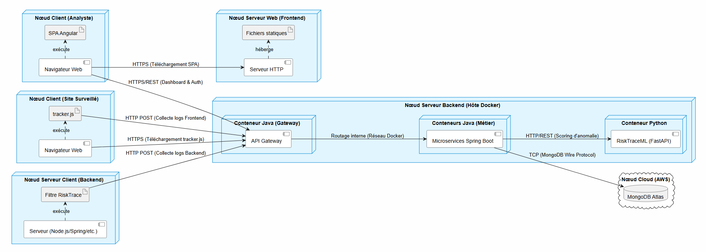

---

## Microservices Breakdown

| Microservice | Port | Database | Primary Responsibility |
|---|---|---|---|
| **discovery-service** | 8761 | None | Netflix Eureka Registry. Acts as the yellow pages for dynamic service registration. |
| **gateway-service** | 8084 | None | Spring Cloud Gateway. Ingress point, CORS configuration, API routing, and JWT validation. |
| **user-service** | 8085 | `userdb` | Multi-tenant auth, BCrypt security, TOTP 2FA, Organization/Team RBAC workflows. |
| **site-service** | 8086 | `sitedb` | Domain validation, Cryptographic API Key generation, and site metadata. |
| **log-service** | 8087 | `logdb` | High-throughput log ingestion, rolling-window calculations, SSE Live Tail, and ML scoring. |
| **alert-service** | 8088 | `alertdb` | Incident lifecycle (OPEN -> RESOLVED), manual escalation, and Thymeleaf emails. |

---

## Core Infrastructure Services

### API Gateway (`gateway-service`)
The Gateway acts as the secure entry point for all frontend traffic.

- **Centralized Authentication Filter (`AuthenticationFilter`):** Intercepts every inbound request to a secured route. It extracts the Bearer token from the `Authorization` header (or from the `token=` query parameter for SSE event streams).
- **Header Injection:** The gateway verifies the signature using `JwtUtils` against the shared `JWT_SECRET`. Upon successful validation, it extracts the user's `Id` and `Email` and injects them as downstream headers (`X-User-Id`, `X-User-Email`). Downstream microservices trust these headers blindly and do not require Spring Security configurations.
- **CORS Management:** CORS policies are declared globally (`CorsConfig.java`), allowing credentials (`setAllowCredentials(true)`) to support HttpOnly cookie exchanges with Angular (`localhost:4200`).

### Service Discovery (`discovery-service`)
Uses Eureka Server (`@EnableEurekaServer`). Services announce their health and dynamically bound ports to Eureka on startup. The Gateway performs load-balanced routing using `lb://USER-SERVICE` prefixes, making local deployment and scaling trivial.

---

## Domain Business Logic

### User Service — Identity and RBAC
- **Brute-Force Lockout:** Tracks failed login attempts. If a user accumulates **5 failed logins**, their account is locked for **24 hours** using automated database timestamps.
- **TOTP MFA Flow:** Integrates `dev.samstevens.totp`. When 2FA is enabled, `UserService` returns an interim `mfaToken` and flag `mfaRequired = true`. The user must submit a 6-digit TOTP token to `/api/auth/verify-2fa` to get their final access token.
- **JWT Rotation:** Issues short-lived access tokens and hashes long-lived refresh tokens using `SHA-256` before writing them to MongoDB. This prevents database leakage from exposing active user sessions.
- **Multi-Tenant Ownership:** Enforces that every organization must have exactly one owner. Operations like team invitations, transfers of ownership, and member removal are guarded by strict role checks.

### Log Service — Real-Time Streaming and ML Scoring
- **Telemetry Ingestion:** Receives telemetry batches via `/api/logs/collect`. It verifies the target site's `apiKey` against its internal `SiteRef` sync repository.
- **Feature Vector Aggregation:** Groups incoming logs by `sessionId`. For each request, it queries the top 100 historical logs for that session, flattens the sequence into a 12-dimensional feature vector, and posts the vector to `RiskTraceML` for scoring.
- **Live Tail Broadcast:**scored logs are added to a thread-safe `List<SseEmitter>`. Subscribers to `/api/logs/stream` receive real-time JSON log streams instantly.

### Alert Service — Automated Escalation
- **Incident Engine:** Creates `Alert` documents when logged anomaly scores exceed the 0.70 threshold.
- **Thymeleaf HTML Mailer:** Sends high-priority formatted security warnings to organization owners. When an analyst clicks "Escalate" in Angular, the service fetches the owner's email from `user-service` and fires the email asynchronously.

---

---

## Physical Data Model & Class Diagram

The database structure maps out the collections across the separate databases (`userdb`, `sitedb`, `logdb`, and `alertdb`). The relationships and core model classes are represented in the UML class diagram below:

  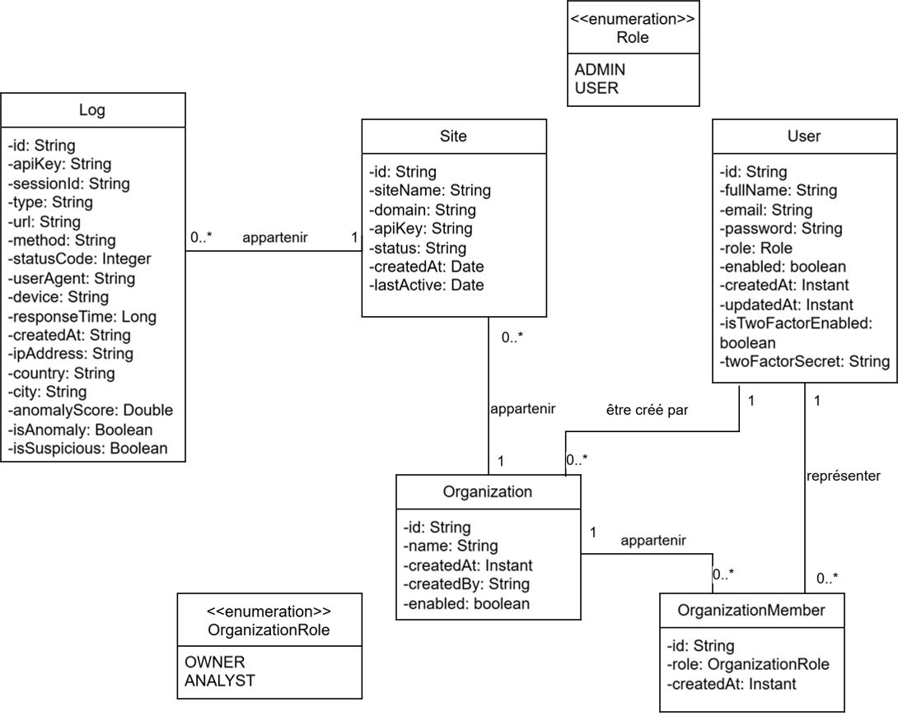

### Physical Data Model (MPD)
This diagram details the actual collections, schemas, and fields implemented inside the MongoDB cluster:

  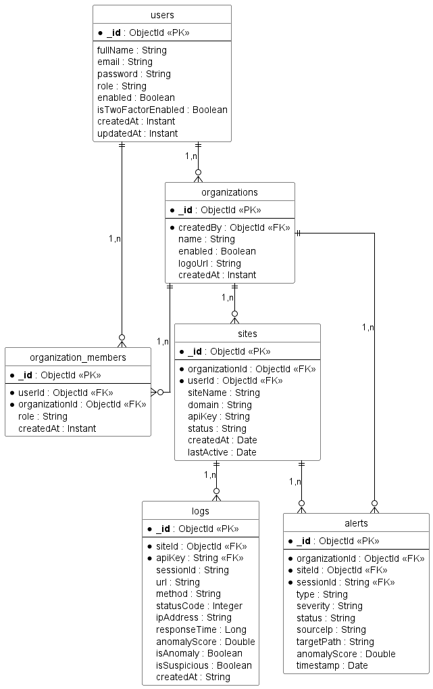

## Core Data Flows (Sequence Diagrams)

### Authentication & Token Refresh Flow

This diagram details the secure user login process, showing how multi-factor authentication (2FA) is enforced and how access tokens are rotated in-memory via HttpOnly cookies.

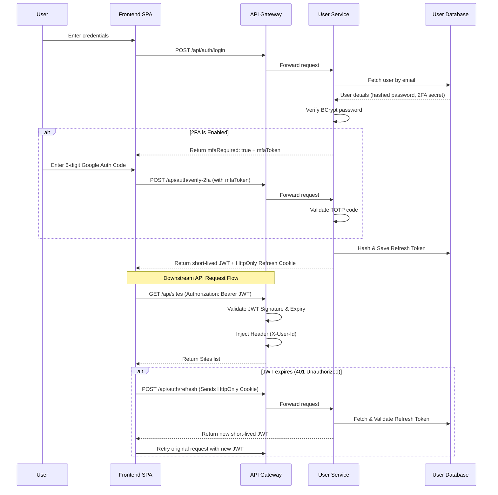
```mermaid
sequenceDiagram
    participant U as User
    participant L as Frontend SPA
    participant GW as API Gateway
    participant US as User Service
    participant DB as User Database

    U->>L: Enter credentials
    L->>GW: POST /api/auth/login
    GW->>US: Forward request
    US->>DB: Fetch user by email
    DB-->>US: User details (hashed password, 2FA secret)
    US->>US: Verify BCrypt password

    alt 2FA is Enabled
        US-->>L: Return mfaRequired: true + mfaToken
        U->>L: Enter 6-digit Google Auth Code
        L->>GW: POST /api/auth/verify-2fa (with mfaToken)
        GW->>US: Forward request
        US->>US: Validate TOTP code
    end

    US->>DB: Hash & Save Refresh Token
    US-->>L: Return short-lived JWT + HttpOnly Refresh Cookie

    Note over L, GW: Downstream API Request Flow
    L->>GW: GET /api/sites (Authorization: Bearer JWT)
    GW->>GW: Validate JWT Signature & Expiry
    GW->>GW: Inject Header (X-User-Id)
    GW-->>L: Return Sites list

    alt JWT expires (401 Unauthorized)
        L->>GW: POST /api/auth/refresh (Sends HttpOnly Cookie)
        GW->>US: Forward request
        US->>DB: Fetch & Validate Refresh Token
        US-->>L: Return new short-lived JWT
        L->>GW: Retry original request with new JWT
    end
```

### Multi-Tenancy Organization Switch Flow

This flow illustrates how switching organizations in the dashboard dynamically propagates updates and filters telemetry downstream across different microservice domains.

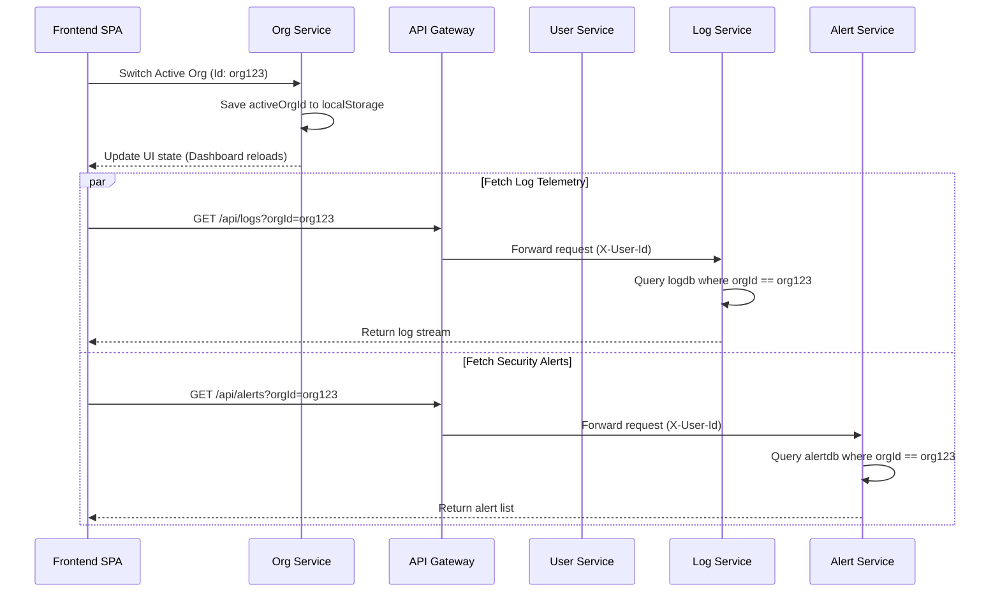
```mermaid
sequenceDiagram
    participant L as Frontend SPA
    participant OS as Org Service
    participant GW as API Gateway
    participant US as User Service
    participant LS as Log Service
    participant AS as Alert Service

    L->>OS: Switch Active Org (Id: org123)
    OS->>OS: Save activeOrgId to localStorage
    OS-->>L: Update UI state (Dashboard reloads)

    par Fetch Log Telemetry
        L->>GW: GET /api/logs?orgId=org123
        GW->>LS: Forward request (X-User-Id)
        LS->>LS: Query logdb where orgId == org123
        LS-->>L: Return log stream
    and Fetch Security Alerts
        L->>GW: GET /api/alerts?orgId=org123
        GW->>AS: Forward request (X-User-Id)
        AS->>AS: Query alertdb where orgId == org123
        AS-->>L: Return alert list
    end
```

---

## Detailed Business Transaction Sequence Diagrams

Below is the complete sequence list for every business transaction in the RiskTrace microservices ecosystem:

### ─── User Registration Flow ───

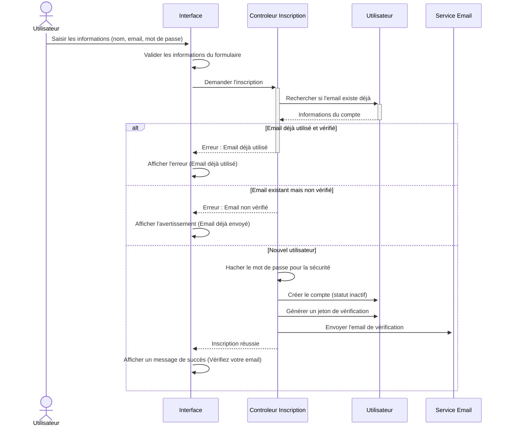
```mermaid
sequenceDiagram
    actor U as Utilisateur
    participant I as Interface
    participant C as Controleur Inscription
    participant DB as Utilisateur
    participant M as Service Email

    U->>+I: Saisir les informations (nom, email, mot de passe)
    I->>I: Valider les informations du formulaire
    I->>+C: Demander l'inscription
    C->>+DB: Rechercher si l'email existe déjà
    DB-->>-C: Informations du compte

    alt Email déjà utilisé et vérifié
        C-->>-I: Erreur : Email déjà utilisé
        I->>I: Afficher l'erreur (Email déjà utilisé)
    else Email existant mais non vérifié
        C-->>I: Erreur : Email non vérifié
        I->>I: Afficher l'avertissement (Email déjà envoyé)
    else Nouvel utilisateur
        C->>C: Hacher le mot de passe pour la sécurité
        C->>+DB: Créer le compte (statut inactif)
        C->>+DB: Générer un jeton de vérification
        C->>+M: Envoyer l'email de vérification
        C-->>I: Inscription réussie
        I->>I: Afficher un message de succès (Vérifiez votre email)
    end
```

 

---

### ─── Email Verification Flow ───

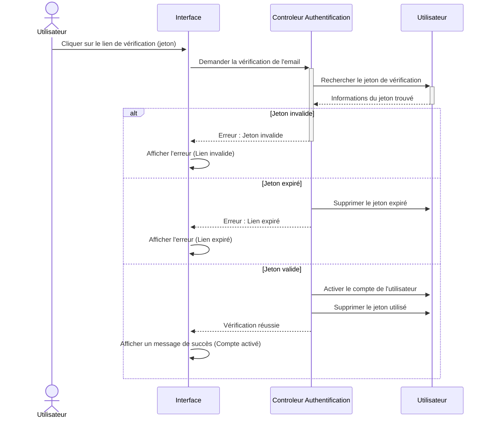
```mermaid
sequenceDiagram
    actor U as Utilisateur
    participant I as Interface
    participant C as Controleur Authentification
    participant DB as Utilisateur

    U->>+I: Cliquer sur le lien de vérification (jeton)
    I->>+C: Demander la vérification de l'email
    C->>+DB: Rechercher le jeton de vérification
    DB-->>-C: Informations du jeton trouvé

    alt Jeton invalide
        C-->>-I: Erreur : Jeton invalide
        I->>I: Afficher l'erreur (Lien invalide)
    else Jeton expiré
        C->>+DB: Supprimer le jeton expiré
        C-->>I: Erreur : Lien expiré
        I->>I: Afficher l'erreur (Lien expiré)
    else Jeton valide
        C->>+DB: Activer le compte de l'utilisateur
        C->>+DB: Supprimer le jeton utilisé
        C-->>I: Vérification réussie
        I->>I: Afficher un message de succès (Compte activé)
    end
```

 

---

### ─── Resend Verification Email Flow ───

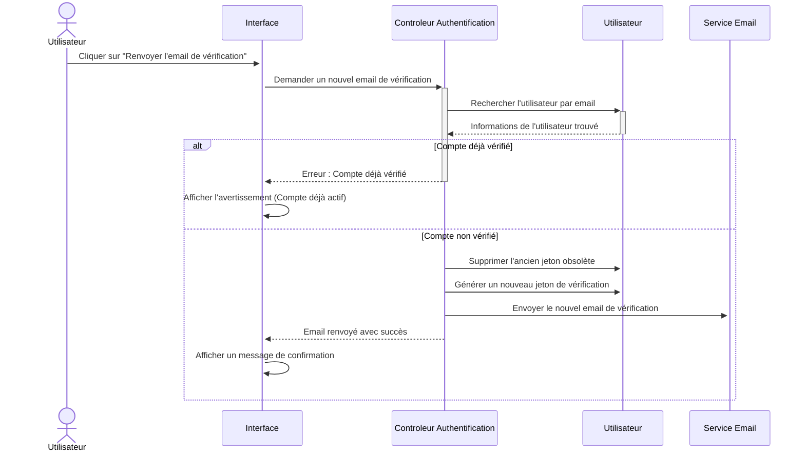
```mermaid
sequenceDiagram
    actor U as Utilisateur
    participant I as Interface
    participant C as Controleur Authentification
    participant DB as Utilisateur
    participant M as Service Email

    U->>+I: Cliquer sur "Renvoyer l'email de vérification"
    I->>+C: Demander un nouvel email de vérification
    C->>+DB: Rechercher l'utilisateur par email
    DB-->>-C: Informations de l'utilisateur trouvé

    alt Compte déjà vérifié
        C-->>-I: Erreur : Compte déjà vérifié
        I->>I: Afficher l'avertissement (Compte déjà actif)
    else Compte non vérifié
        C->>+DB: Supprimer l'ancien jeton obsolète
        C->>+DB: Générer un nouveau jeton de vérification
        C->>+M: Envoyer le nouvel email de vérification
        C-->>I: Email renvoyé avec succès
        I->>I: Afficher un message de confirmation
    end
```

 

---

### ─── Password Reset Flow ───

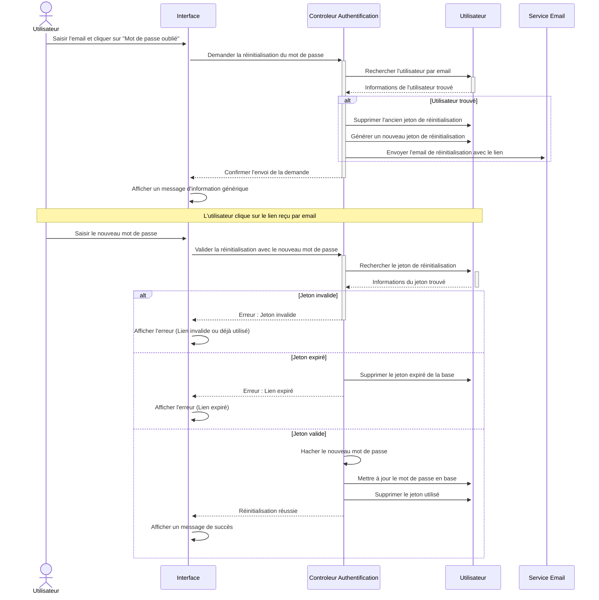
```mermaid
sequenceDiagram
    actor U as Utilisateur
    participant I as Interface
    participant C as Controleur Authentification
    participant DB as Utilisateur
    participant M as Service Email

    U->>+I: Saisir l'email et cliquer sur "Mot de passe oublié"
    I->>+C: Demander la réinitialisation du mot de passe
    C->>+DB: Rechercher l'utilisateur par email
    DB-->>-C: Informations de l'utilisateur trouvé

    alt Utilisateur trouvé
        C->>+DB: Supprimer l'ancien jeton de réinitialisation
        C->>+DB: Générer un nouveau jeton de réinitialisation
        C->>+M: Envoyer l'email de réinitialisation avec le lien
    end

    C-->>-I: Confirmer l'envoi de la demande
    I->>I: Afficher un message d'information générique

    Note over U,DB: L'utilisateur clique sur le lien reçu par email

    U->>+I: Saisir le nouveau mot de passe
    I->>+C: Valider la réinitialisation avec le nouveau mot de passe
    C->>+DB: Rechercher le jeton de réinitialisation
    DB-->>-C: Informations du jeton trouvé

    alt Jeton invalide
        C-->>-I: Erreur : Jeton invalide
        I->>I: Afficher l'erreur (Lien invalide ou déjà utilisé)
    else Jeton expiré
        C->>+DB: Supprimer le jeton expiré de la base
        C-->>I: Erreur : Lien expiré
        I->>I: Afficher l'erreur (Lien expiré)
    else Jeton valide
        C->>C: Hacher le nouveau mot de passe
        C->>+DB: Mettre à jour le mot de passe en base
        C->>+DB: Supprimer le jeton utilisé
        C-->>I: Réinitialisation réussie
        I->>I: Afficher un message de succès
    end
```

 

---

### ─── Two-Factor Authentication Flow ───

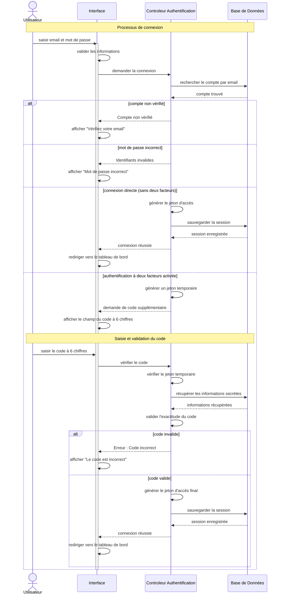
```mermaid
sequenceDiagram
    actor U as Utilisateur
    participant I as Interface
    participant C as Controleur Authentification
    participant DB as Base de Données

    Note over U,DB: Processus de connexion

    U->>I: saisir email et mot de passe
    activate I
    I->>I: valider les informations
    I->>C: demander la connexion
    C->>DB: rechercher le compte par email
    DB-->>C: compte trouvé

    alt compte non vérifié
        C-->>I: Compte non vérifié
        I->>I: afficher "Vérifiez votre email"
    else mot de passe incorrect
        C-->>I: Identifiants invalides
        I->>I: afficher "Mot de passe incorrect"
    else connexion directe (sans deux facteurs)
        C->>C: générer le jeton d'accès
        C->>DB: sauvegarder la session
        DB-->>C: session enregistrée
        C-->>I: connexion réussie
        I->>I: rediriger vers le tableau de bord
    else authentification à deux facteurs activée
        C->>C: générer un jeton temporaire
        C-->>I: demande de code supplémentaire
        I->>I: afficher le champ du code à 6 chiffres
        
        Note over U,DB: Saisie et validation du code
        
        U->>I: saisir le code à 6 chiffres
        I->>C: vérifier le code
        C->>C: vérifier le jeton temporaire
        C->>DB: récupérer les informations secrètes
        DB-->>C: informations récupérées
        C->>C: valider l'exactitude du code

        alt code invalide
            C-->>I: Erreur : Code incorrect
            I->>I: afficher "Le code est incorrect"
        else code valide
            C->>C: générer le jeton d'accès final
            C->>DB: sauvegarder la session
            DB-->>C: session enregistrée
            C-->>I: connexion réussie
            I->>I: rediriger vers le tableau de bord
        end
    end
    deactivate I
```

 

---

### ─── JWT Token Refresh Flow ───

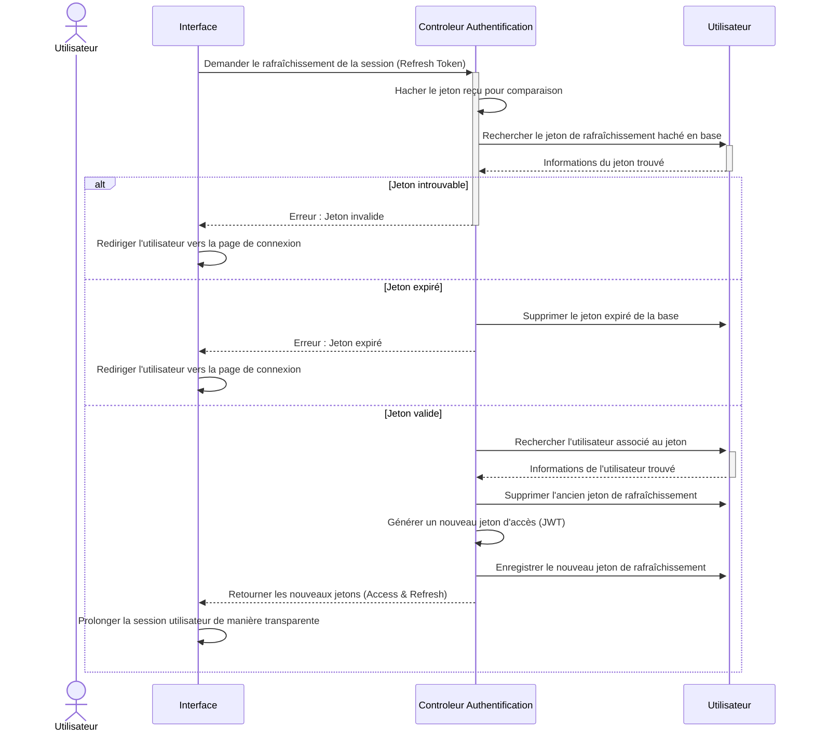
```mermaid
sequenceDiagram
    actor U as Utilisateur
    participant I as Interface
    participant C as Controleur Authentification
    participant DB as Utilisateur

    I->>+C: Demander le rafraîchissement de la session (Refresh Token)
    C->>C: Hacher le jeton reçu pour comparaison
    C->>+DB: Rechercher le jeton de rafraîchissement haché en base
    DB-->>-C: Informations du jeton trouvé

    alt Jeton introuvable
        C-->>-I: Erreur : Jeton invalide
        I->>I: Rediriger l'utilisateur vers la page de connexion
    else Jeton expiré
        C->>+DB: Supprimer le jeton expiré de la base
        C-->>I: Erreur : Jeton expiré
        I->>I: Rediriger l'utilisateur vers la page de connexion
    else Jeton valide
        C->>+DB: Rechercher l'utilisateur associé au jeton
        DB-->>-C: Informations de l'utilisateur trouvé
        C->>+DB: Supprimer l'ancien jeton de rafraîchissement
        C->>C: Générer un nouveau jeton d'accès (JWT)
        C->>+DB: Enregistrer le nouveau jeton de rafraîchissement
        C-->>I: Retourner les nouveaux jetons (Access & Refresh)
        I->>I: Prolonger la session utilisateur de manière transparente
    end
```

 

---

### ─── Logout Flow ───

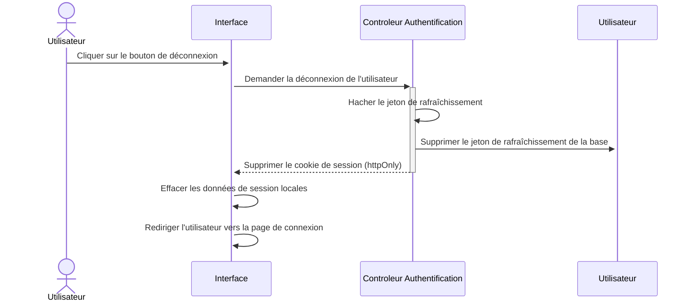
```mermaid
sequenceDiagram
    actor U as Utilisateur
    participant I as Interface
    participant C as Controleur Authentification
    participant DB as Utilisateur

    U->>+I: Cliquer sur le bouton de déconnexion
    I->>+C: Demander la déconnexion de l'utilisateur
    C->>C: Hacher le jeton de rafraîchissement
    C->>+DB: Supprimer le jeton de rafraîchissement de la base
    C-->>-I: Supprimer le cookie de session (httpOnly)
    I->>I: Effacer les données de session locales
    I->>I: Rediriger l'utilisateur vers la page de connexion
```

 

---

### ─── User Profile Management Flow ───

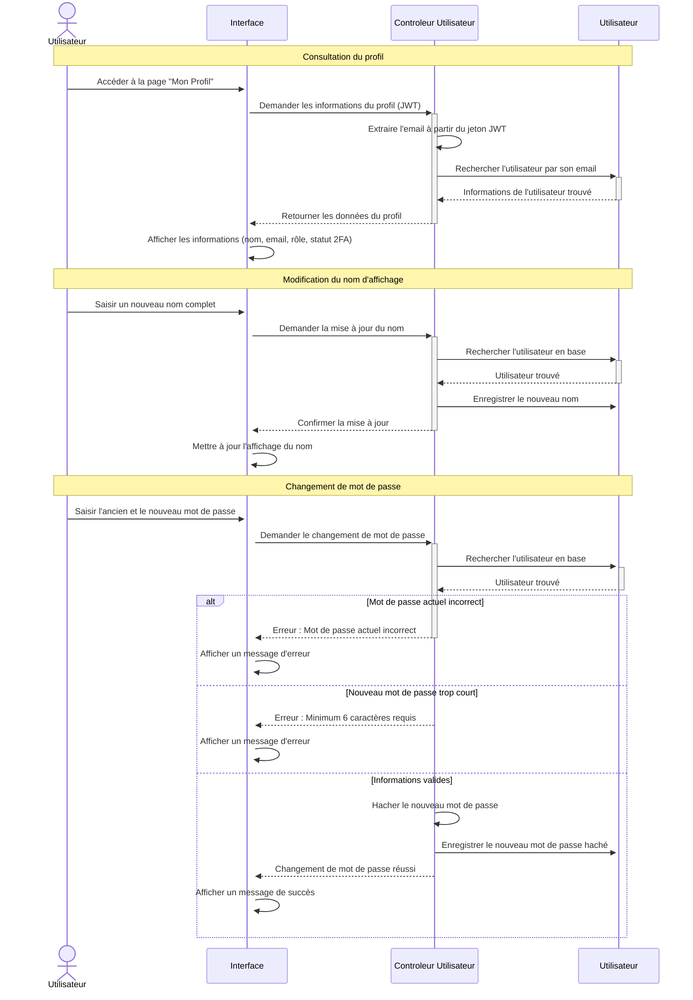
```mermaid
sequenceDiagram
    actor U as Utilisateur
    participant I as Interface
    participant C as Controleur Utilisateur
    participant DB as Utilisateur

    Note over U,DB: Consultation du profil

    U->>+I: Accéder à la page "Mon Profil"
    I->>+C: Demander les informations du profil (JWT)
    C->>C: Extraire l'email à partir du jeton JWT
    C->>+DB: Rechercher l'utilisateur par son email
    DB-->>-C: Informations de l'utilisateur trouvé
    C-->>-I: Retourner les données du profil
    I->>I: Afficher les informations (nom, email, rôle, statut 2FA)

    Note over U,DB: Modification du nom d'affichage

    U->>+I: Saisir un nouveau nom complet
    I->>+C: Demander la mise à jour du nom
    C->>+DB: Rechercher l'utilisateur en base
    DB-->>-C: Utilisateur trouvé
    C->>+DB: Enregistrer le nouveau nom
    C-->>-I: Confirmer la mise à jour
    I->>I: Mettre à jour l'affichage du nom

    Note over U,DB: Changement de mot de passe

    U->>+I: Saisir l'ancien et le nouveau mot de passe
    I->>+C: Demander le changement de mot de passe
    C->>+DB: Rechercher l'utilisateur en base
    DB-->>-C: Utilisateur trouvé

    alt Mot de passe actuel incorrect
        C-->>-I: Erreur : Mot de passe actuel incorrect
        I->>I: Afficher un message d'erreur
    else Nouveau mot de passe trop court
        C-->>I: Erreur : Minimum 6 caractères requis
        I->>I: Afficher un message d'erreur
    else Informations valides
        C->>C: Hacher le nouveau mot de passe
        C->>+DB: Enregistrer le nouveau mot de passe haché
        C-->>I: Changement de mot de passe réussi
        I->>I: Afficher un message de succès
    end
```

 

---

### ─── Admin User Management Flow ───

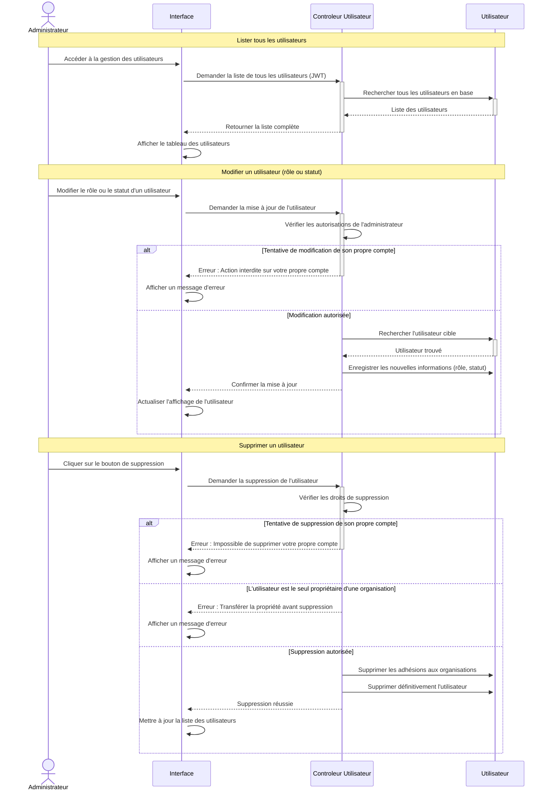
```mermaid
sequenceDiagram
    actor A as Administrateur
    participant I as Interface
    participant C as Controleur Utilisateur
    participant DB as Utilisateur

    Note over A,DB: Lister tous les utilisateurs

    A->>+I: Accéder à la gestion des utilisateurs
    I->>+C: Demander la liste de tous les utilisateurs (JWT)
    C->>+DB: Rechercher tous les utilisateurs en base
    DB-->>-C: Liste des utilisateurs
    C-->>-I: Retourner la liste complète
    I->>I: Afficher le tableau des utilisateurs

    Note over A,DB: Modifier un utilisateur (rôle ou statut)

    A->>+I: Modifier le rôle ou le statut d'un utilisateur
    I->>+C: Demander la mise à jour de l'utilisateur
    C->>C: Vérifier les autorisations de l'administrateur

    alt Tentative de modification de son propre compte
        C-->>-I: Erreur : Action interdite sur votre propre compte
        I->>I: Afficher un message d'erreur
    else Modification autorisée
        C->>+DB: Rechercher l'utilisateur cible
        DB-->>-C: Utilisateur trouvé
        C->>+DB: Enregistrer les nouvelles informations (rôle, statut)
        C-->>I: Confirmer la mise à jour
        I->>I: Actualiser l'affichage de l'utilisateur
    end

    Note over A,DB: Supprimer un utilisateur

    A->>+I: Cliquer sur le bouton de suppression
    I->>+C: Demander la suppression de l'utilisateur
    C->>C: Vérifier les droits de suppression

    alt Tentative de suppression de son propre compte
        C-->>-I: Erreur : Impossible de supprimer votre propre compte
        I->>I: Afficher un message d'erreur
    else L'utilisateur est le seul propriétaire d'une organisation
        C-->>I: Erreur : Transférer la propriété avant suppression
        I->>I: Afficher un message d'erreur
    else Suppression autorisée
        C->>+DB: Supprimer les adhésions aux organisations
        C->>+DB: Supprimer définitivement l'utilisateur
        C-->>I: Suppression réussie
        I->>I: Mettre à jour la liste des utilisateurs
    end
```

 

---

### ─── Organization & Team Management Flow ───

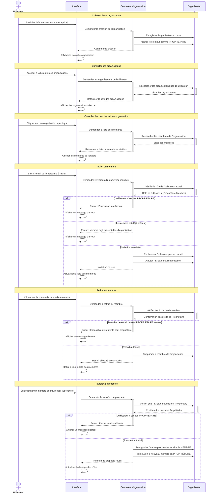
```mermaid
sequenceDiagram
    actor U as Utilisateur
    participant I as Interface
    participant C as Controleur Organisation
    participant DB as Organisation

    Note over U,DB: Création d'une organisation

    U->>+I: Saisir les informations (nom, description)
    I->>+C: Demander la création de l'organisation
    C->>+DB: Enregistrer l'organisation en base
    C->>+DB: Ajouter le créateur comme PROPRIÉTAIRE
    C-->>-I: Confirmer la création
    I->>I: Afficher la nouvelle organisation

    Note over U,DB: Consulter ses organisations

    U->>+I: Accéder à la liste de mes organisations
    I->>+C: Demander les organisations de l'utilisateur
    C->>+DB: Rechercher les organisations par ID utilisateur
    DB-->>-C: Liste des organisations
    C-->>-I: Retourner la liste des organisations
    I->>I: Afficher les organisations à l'écran

    Note over U,DB: Consulter les membres d'une organisation

    U->>+I: Cliquer sur une organisation spécifique
    I->>+C: Demander la liste des membres
    C->>+DB: Rechercher les membres de l'organisation
    DB-->>-C: Liste des membres
    C-->>-I: Retourner la liste des membres et rôles
    I->>I: Afficher les membres de l'équipe

    Note over U,DB: Inviter un membre

    U->>+I: Saisir l'email de la personne à inviter
    I->>+C: Demander l'invitation d'un nouveau membre
    C->>+DB: Vérifier le rôle de l'utilisateur actuel
    DB-->>-C: Rôle de l'utilisateur (Propriétaire/Membre)

    alt L'utilisateur n'est pas PROPRIÉTAIRE
        C-->>-I: Erreur : Permission insuffisante
        I->>I: Afficher un message d'erreur
    else Le membre est déjà présent
        C-->>I: Erreur : Membre déjà présent dans l'organisation
        I->>I: Afficher un message d'erreur
    else Invitation autorisée
        C->>+DB: Rechercher l'utilisateur par son email
        C->>+DB: Ajouter l'utilisateur à l'organisation
        C-->>I: Invitation réussie
        I->>I: Actualiser la liste des membres
    end

    Note over U,DB: Retirer un membre

    U->>+I: Cliquer sur le bouton de retrait d'un membre
    I->>+C: Demander le retrait du membre
    C->>+DB: Vérifier les droits du demandeur
    DB-->>-C: Confirmation des droits de Propriétaire

    alt Tentative de retrait du seul PROPRIÉTAIRE restant
        C-->>-I: Erreur : Impossible de retirer le seul propriétaire
        I->>I: Afficher un message d'erreur
    else Retrait autorisé
        C->>+DB: Supprimer le membre de l'organisation
        C-->>I: Retrait effectué avec succès
        I->>I: Mettre à jour la liste des membres
    end

    Note over U,DB: Transfert de propriété

    U->>+I: Sélectionner un membre pour lui céder la propriété
    I->>+C: Demander le transfert de propriété
    C->>+DB: Vérifier que l'utilisateur actuel est Propriétaire
    DB-->>-C: Confirmation du statut Propriétaire

    alt L'utilisateur n'est pas PROPRIÉTAIRE
        C-->>-I: Erreur : Permission insuffisante
        I->>I: Afficher un message d'erreur
    else Transfert autorisé
        C->>+DB: Rétrograder l'ancien propriétaire en simple MEMBRE
        C->>+DB: Promouvoir le nouveau membre en PROPRIÉTAIRE
        C-->>I: Transfert de propriété réussi
        I->>I: Actualiser l'affichage des rôles
    end
```

 

---

### ─── Admin Organization Oversight Flow ───

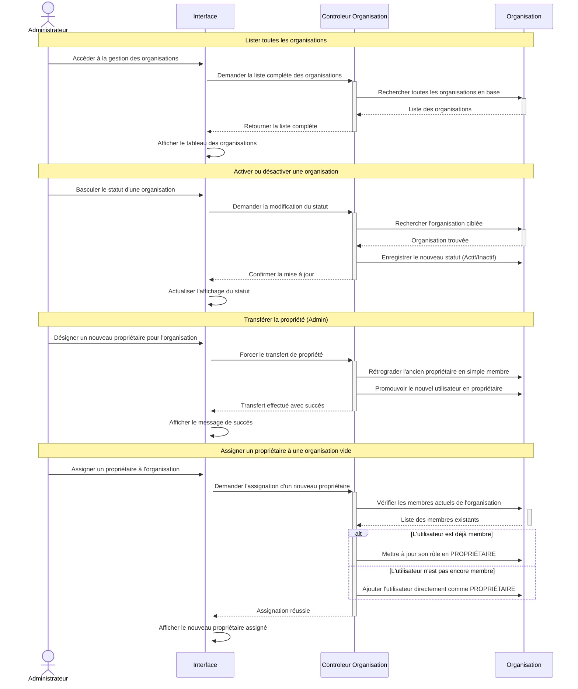
```mermaid
sequenceDiagram
    actor A as Administrateur
    participant I as Interface
    participant C as Controleur Organisation
    participant DB as Organisation

    Note over A,DB: Lister toutes les organisations

    A->>+I: Accéder à la gestion des organisations
    I->>+C: Demander la liste complète des organisations
    C->>+DB: Rechercher toutes les organisations en base
    DB-->>-C: Liste des organisations
    C-->>-I: Retourner la liste complète
    I->>I: Afficher le tableau des organisations

    Note over A,DB: Activer ou désactiver une organisation

    A->>+I: Basculer le statut d'une organisation
    I->>+C: Demander la modification du statut
    C->>+DB: Rechercher l'organisation ciblée
    DB-->>-C: Organisation trouvée
    C->>+DB: Enregistrer le nouveau statut (Actif/Inactif)
    C-->>-I: Confirmer la mise à jour
    I->>I: Actualiser l'affichage du statut

    Note over A,DB: Transférer la propriété (Admin)

    A->>+I: Désigner un nouveau propriétaire pour l'organisation
    I->>+C: Forcer le transfert de propriété
    C->>+DB: Rétrograder l'ancien propriétaire en simple membre
    C->>+DB: Promouvoir le nouvel utilisateur en propriétaire
    C-->>-I: Transfert effectué avec succès
    I->>I: Afficher le message de succès

    Note over A,DB: Assigner un propriétaire à une organisation vide

    A->>+I: Assigner un propriétaire à l'organisation
    I->>+C: Demander l'assignation d'un nouveau propriétaire
    C->>+DB: Vérifier les membres actuels de l'organisation
    DB-->>-C: Liste des membres existants

    alt L'utilisateur est déjà membre
        C->>+DB: Mettre à jour son rôle en PROPRIÉTAIRE
    else L'utilisateur n'est pas encore membre
        C->>+DB: Ajouter l'utilisateur directement comme PROPRIÉTAIRE
    end

    C-->>-I: Assignation réussie
    I->>I: Afficher le nouveau propriétaire assigné
```

 

---

### ─── Log Collection (Tracker.js) Flow ───

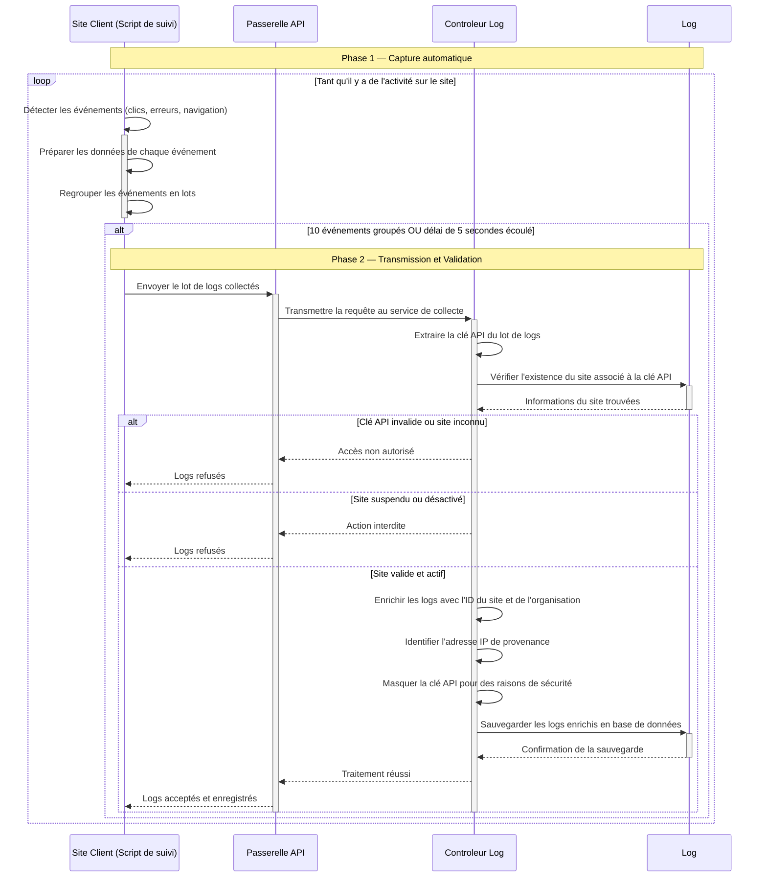
```mermaid
sequenceDiagram
    participant S as Site Client (Script de suivi)
    participant G as Passerelle API
    participant C as Controleur Log
    participant DB as Log

    Note over S,DB: Phase 1 — Capture automatique

    loop Tant qu'il y a de l'activité sur le site
        S->>+S: Détecter les événements (clics, erreurs, navigation)
        S->>S: Préparer les données de chaque événement
        S->>S: Regrouper les événements en lots
        deactivate S

        alt 10 événements groupés OU délai de 5 secondes écoulé
            Note over S,DB: Phase 2 — Transmission et Validation

            S->>+G: Envoyer le lot de logs collectés
            G->>+C: Transmettre la requête au service de collecte
            C->>C: Extraire la clé API du lot de logs
            C->>+DB: Vérifier l'existence du site associé à la clé API
            DB-->>-C: Informations du site trouvées

            alt Clé API invalide ou site inconnu
                C-->>G: Accès non autorisé
                G-->>S: Logs refusés
            else Site suspendu ou désactivé
                C-->>G: Action interdite
                G-->>S: Logs refusés
            else Site valide et actif
                C->>C: Enrichir les logs avec l'ID du site et de l'organisation
                C->>C: Identifier l'adresse IP de provenance
                C->>C: Masquer la clé API pour des raisons de sécurité
                C->>+DB: Sauvegarder les logs enrichis en base de données
                DB-->>-C: Confirmation de la sauvegarde
                C-->>G: Traitement réussi
                G-->>S: Logs acceptés et enregistrés
            end
            deactivate C
            deactivate G
        end
    end
```

 

---

### ─── Log Exploration & SSE Live Tail Flow ───

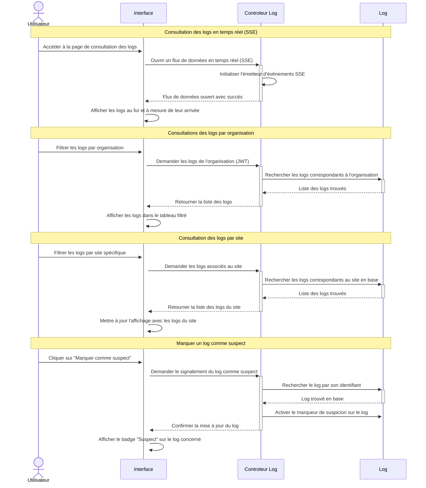
```mermaid
sequenceDiagram
    actor U as Utilisateur
    participant I as Interface
    participant C as Controleur Log
    participant DB as Log

    Note over U,DB: Consultation des logs en temps réel (SSE)

    U->>+I: Accéder à la page de consultation des logs
    I->>+C: Ouvrir un flux de données en temps réel (SSE)
    C->>C: Initialiser l'émetteur d'événements SSE
    C-->>-I: Flux de données ouvert avec succès
    I->>I: Afficher les logs au fur et à mesure de leur arrivée

    Note over U,DB: Consultations des logs par organisation

    U->>+I: Filtrer les logs par organisation
    I->>+C: Demander les logs de l'organisation (JWT)
    C->>+DB: Rechercher les logs correspondants à l'organisation
    DB-->>-C: Liste des logs trouvés
    C-->>-I: Retourner la liste des logs
    I->>I: Afficher les logs dans le tableau filtré

    Note over U,DB: Consultation des logs par site

    U->>+I: Filtrer les logs par site spécifique
    I->>+C: Demander les logs associés au site
    C->>+DB: Rechercher les logs correspondants au site en base
    DB-->>-C: Liste des logs trouvés
    C-->>-I: Retourner la liste des logs du site
    I->>I: Mettre à jour l'affichage avec les logs du site

    Note over U,DB: Marquer un log comme suspect

    U->>+I: Cliquer sur "Marquer comme suspect"
    I->>+C: Demander le signalement du log comme suspect
    C->>+DB: Rechercher le log par son identifiant
    DB-->>-C: Log trouvé en base
    C->>+DB: Activer le marqueur de suspicion sur le log
    C-->>-I: Confirmer la mise à jour du log
    I->>I: Afficher le badge "Suspect" sur le log concerné
```

 

---

### ─── AI Anomaly Analysis & Alert Triggering Flow ───

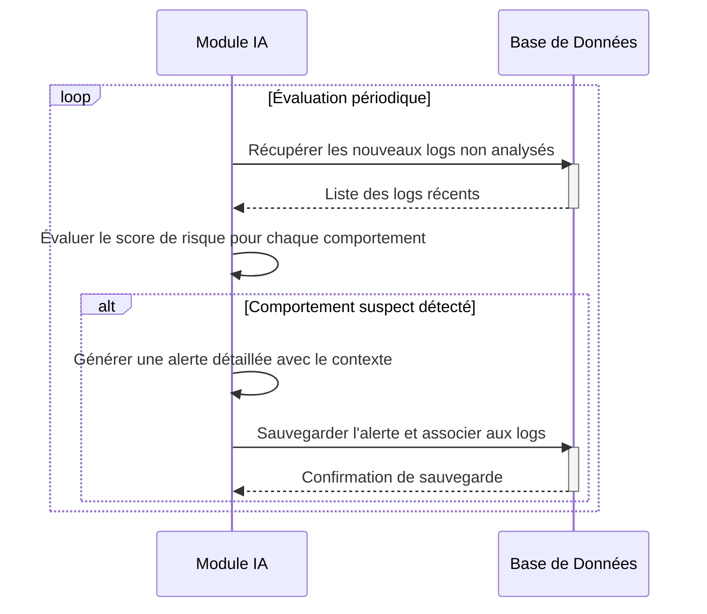
```mermaid
sequenceDiagram
    participant C as Module IA
    participant DB as Base de Données

    loop Évaluation périodique                                                                                    
        C->>DB: Récupérer les nouveaux logs non analysés
        activate DB
        DB-->>C: Liste des logs récents
        deactivate DB
        C->>C: Évaluer le score de risque pour chaque comportement
        
        alt Comportement suspect détecté                                                                          
            C->>C: Générer une alerte détaillée avec le contexte
            C->>DB: Sauvegarder l'alerte et associer aux logs
            activate DB
            DB-->>C: Confirmation de sauvegarde
            deactivate DB
        end
    end
```

 

---

## Unit Testing & Verification

Quality assurance across the microservices relies on mock-driven unit testing to validate JWT filters and security boundaries.

### Alert Service Unit Tests
Ensures correct state transitions for open, ignored, and resolved alerts under multiple concurrent threads.

  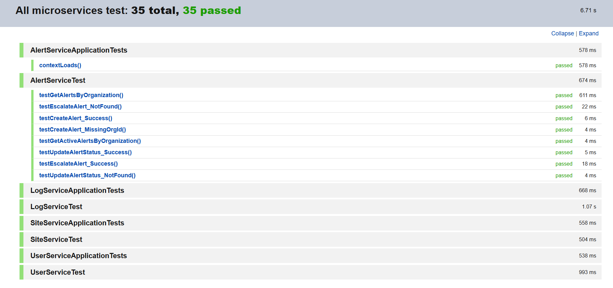

### Log Service Unit Tests
Validates the telemetry aggregator and checks that bad API keys are correctly rejected with a 403 Forbidden.

  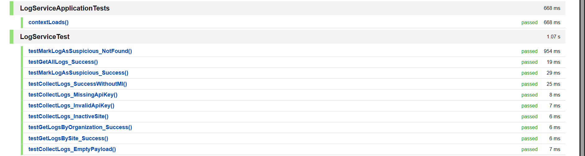

### Site Service Unit Tests
Tests cryptographic API key generation and ensures domain format validators block malformed domain strings.

  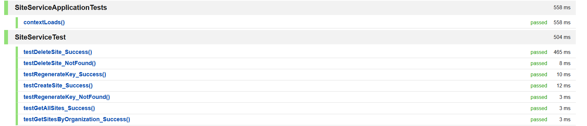

### User Service Unit Tests
Tests BCrypt password hashing, TOTP validation math, and the 5-attempt lockout timer logic.

  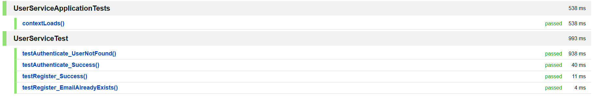

